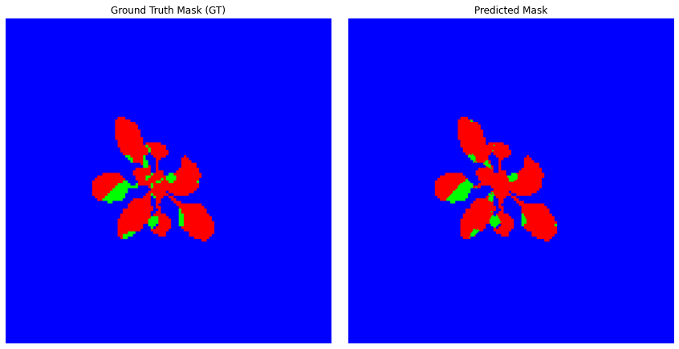
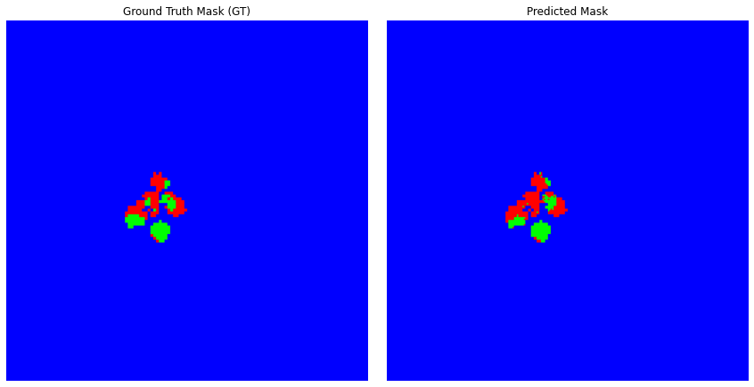
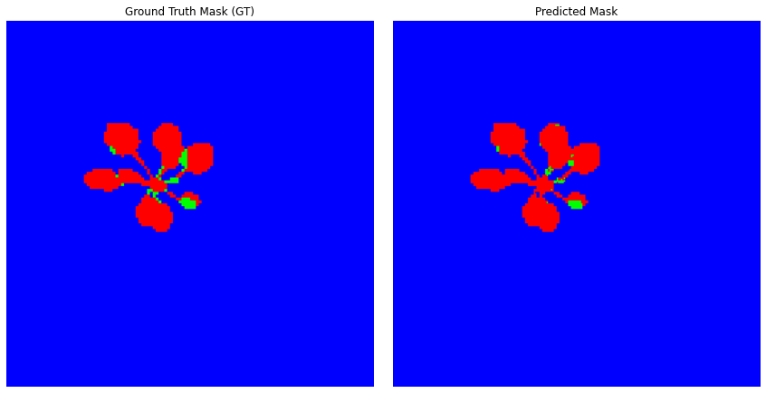
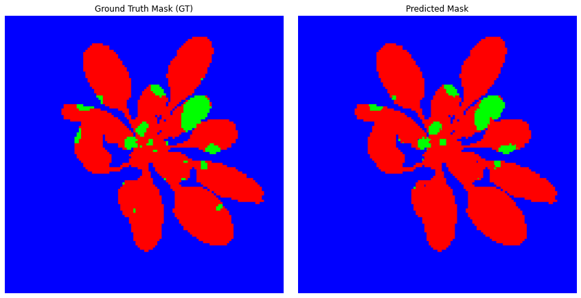
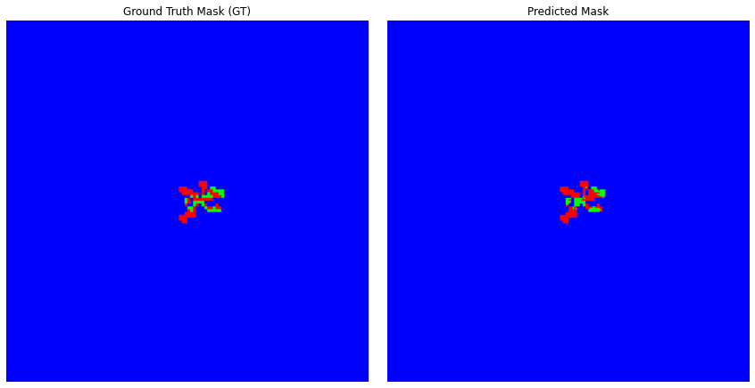

# Project for INRAE Angers

This project aims to segment plant diseases using synthetic data provided by INRAE.

## 🔬 Objective

- Develop a semantic segmentation pipeline for plant disease symptoms using synthetic chlorophyll fluorescence images.
- Train models that generalize well from synthetic to real data (sim-to-real transfer).
- Compare different architectures and backbones.
- Evaluate performance using multiple metrics.

## 🏗️ Models Used

- **Architectures**: U-Net, DeepLabv3, FPN  
- **Backbones**: ResNet34, ResNet152  
- **Framework**: PyTorch + Segmentation Models PyTorch (SMP)

## 📈 Evaluation Metrics

- Dice Coefficient
- Jaccard Index (IoU)
- Conformity Coefficient (CC)
- Precision and Recall

## 📷 Visualization

Example results, including masks and segmentation overlays, can be found in the `assets/` directory.
